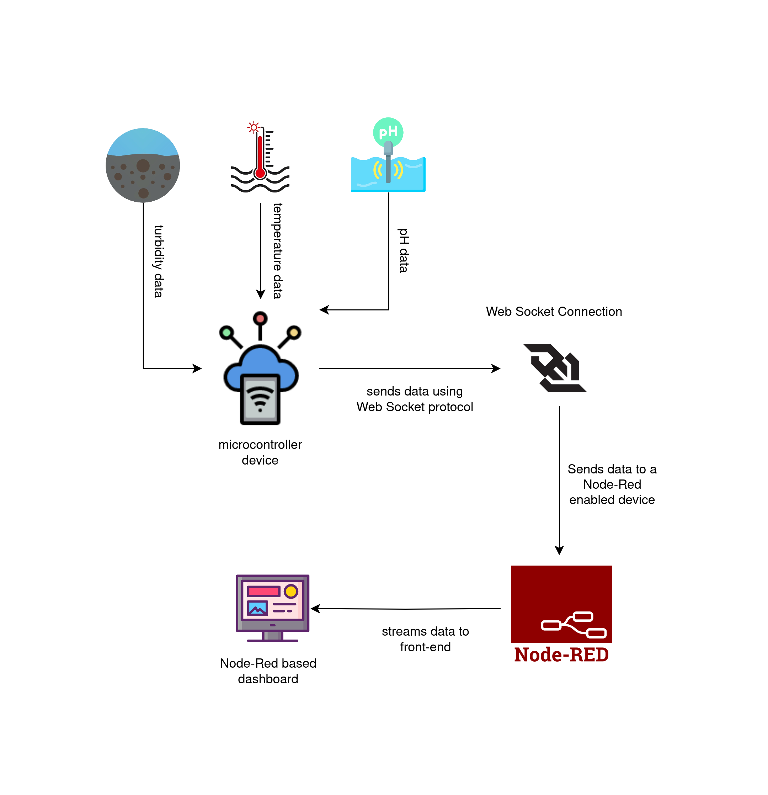
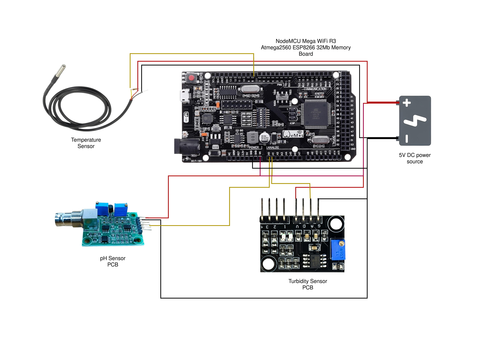

# IoT Based Recirculating Aquaculture System
Aquaculture systems are integrating Internet of
Things (IoT) technologies due to the growing demand for sustain-
able fish production. The IoT-based Recirculating Aquaculture
System presented in this research aims to optimize water quality
management by means of real-time control and monitoring. The
system uses temperature, turbidity, and pH sensors to gather
water quality data. After processing, data is wirelessly sent to
a device with Node-Red support for visualization. Nevertheless,
throughout the development stage, issues with sensor accuracy
and connectivity arose, which had an impact on the accuracy
of turbidity measurements. The promise and difficulties of
integrating IoT in aquaculture for efficient and sustainable fish
production are highlighted by this study.


<hr>

Sensors used in this project:

|**Sensor**|**Purchased From**|
|:--------:|:----------------:|
|Waterproof DS18B20 Digital Thermal Probe or Sensor|https://store.roboticsbd.com/robotics-parts/414-waterproof-ds18b20-digital-thermal-probe-or-sensor-robotics-bangladesh.html|
|pH Sensor Analog Meter Kit For Arduino|https://store.roboticsbd.com/sensors/523-analog-ph-sensor-meter-kit-for-arduino-robotics-bangladesh.html|
|Liquid Suspended Particles Turbidity Sensor Detection Module Kit|https://store.roboticsbd.com/sensors/1405-turbidity-sensor-suspended-turbidity-value-detection-module-kit-robotics-bangladesh.html|

To control and process the data from the sensors a modified micro-controller board is used which can be found here - [NodeMCU Mega WiFi R3 Atmega2560 ESP8266 32Mb Memory Board](https://store.roboticsbd.com/arduino-bangladesh/2138-nodemcu-mega-wifi-r3-atmega2560-esp8266-32mb-memory-board-robotics-bangladesh.html) .

<hr>

All the sensors can be integrated by just simply following the circuit diagram attached below:
  

<hr>

To program the micro-controller [Arduino IDE](https://www.arduino.cc/en/software) can be used. Before writing code the ide must be ready for the board. 
<br>
- First add this url to `File > Preferences > Additional Board URLS` and click on `OK`
```bash
https://arduino.esp8266.com/stable/package_esp8266com_index.json
```
- Then install the [esp32 board manager](https://github.com/espressif/arduino-esp32) by clicking on the icon from the left side or `Tools > Board > Boards Manger` and search for `esp32`

Keep only switches 3 and 4 turned on to program the `Arduino Mega 2560` board. Write the code provided here - [ras_mega](code/ras_mega.ino).

The `ESP8266` board requires switches 5, 6, and 7  to be turned on in order to program. Write the code provided here - [ras_esp](code/esp_ws.ino). Before writing to the `ESP8266` update the `ssid` and `password` variables.